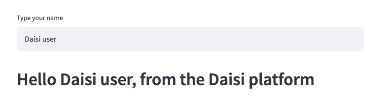
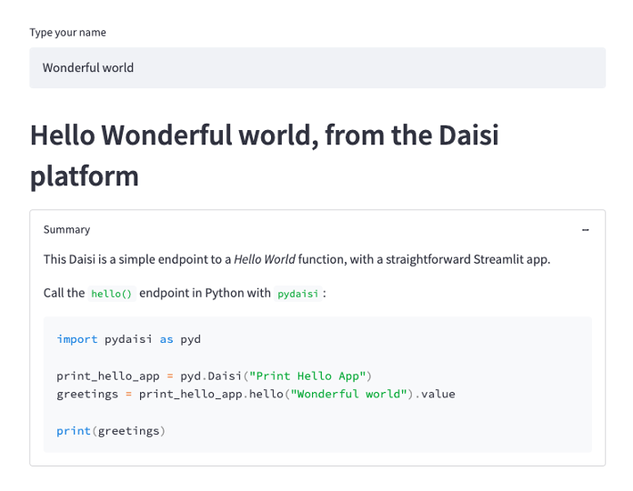

# Build a UI with Streamlit

Showcase the capabilities of your Daisies by giving them a front-end with [Streamlit](https://docs.streamlit.io).
This is a great way to let your users test and understand what your Daisies can do.  

When you import ``streamlit`` in your code, the
button **Launch the app** will be active in the Daisi page on [app.daisi.io](app.daisi.io) as well as
the **App** button will be active on the Daisi card in the catalog.

Any **Streamlit** app which runs in your local environment should run similarily when deployed on the **Daisi** platform.  

A good practice is to write the Streamlit commands inside a dedicated function and call this function in a
``if __name__ == "__main__"`` block, so it will not be imported when the Daisi is loaded for execution. If not, it will not prevent
your Daisi to load and be executed, but it might make it slower.

## Example

```python
  import streamlit as st

  def hello(name="World"):
    return "Hello " + str(name)
  
  def st_ui():
    name = st.text_input('Type your name')
    st.header(hello(name))
  
  if __name__ == "__main__":
    st_ui()
```

Turn this code into a daisi named **Print Hello App** by linking its Github repo in the Daisi platform.  

You have instantly an endpoint for the ``hello()`` function as well as a **Streamlit** app with a shareable URL.  

The **Launch the app** button is now active in the Daisi page, as well as the **App**
button on this Daisi's card in the catalog (see image below).

{ align=left }

Check it out here : ["Print Hello App"](https://app.daisi.io/daisies/46c4198a-9def-43c4-af9a-38d4659be737/how-to-use)

### UI rendering

Click on the **Launch the App** button. It will redirect you to a new browser tab displaying the app.

{ align=left }

### Invokation

Invoke the `#!python hello()` endpoint with `#!python pydaisi` :

```python
import pydaisi as pyd

printhello = pyd.Daisi("exampledaisies/Print Hello App")
print(printhello.hello().value)
```

## Adding documentation inside the Streamlit app

We strongly encourage Daisies creators to add a Markdown text in their Streamlit app wich reminds
how to call the Daisi with a straight forward example, similar to what you could put in your *DAISI.md* readme. 
To keep the app clean, you can add the Markdown text inside an `expander` component, like this:

```python
import streamlit as st

with st.expander("Summary"):
  st.markdown('''A Markdown text explaining how to call the Daisi''')
```

After adding a Markdown text, the **Streamlit** app for the above Daisi renders like this :

{ align=left }