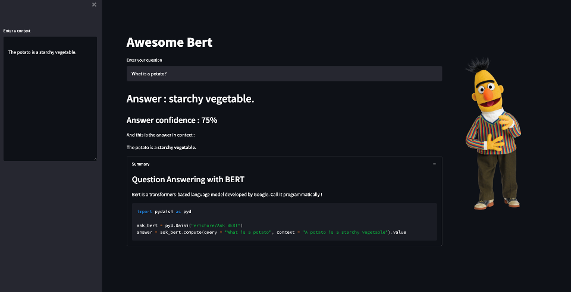

# Remixing daisies

We have seen how to call Daisies remotely in Python with `pydaisi`.
Because Daisies are simply Python code, they can also call other Daisies.

This allows to rework the output of a Daisi with an other one, build workflows, orchestrations,
give a Streamlit UI to a Daisi that you like, and so much more !

Daisies which call other Daisies will feature a different icon on their card.
{ width="50" }

## A simple example

The "Ask Bert" Daisi returns data in a JSON format, which needs to be parsed
to extract the answer returned by the model.

Let's build a new Daisi, which will call "Ask Bert", post process its data and return them in a different format.
And we can also build a nicer UI for Bert in this new Daisi.

The code of the new Daisi simply looks like :

```python
import pydaisi as pyd
import streamlit as st

# Call the "Ask BERT" Daisi
ask_bert = pyd.Daisi("exampledaisies/Ask BERT")

# get_answer() is an endpoint
def get_answer(context, query):
    answer = ask_bert.compute(query, context).value

    # Post process the "Ask BERT" Daisi return
    staight_answer = answer[0]['data']['answer']
    answer_proba = int(100*float(answer[0]['data']['score']))
    highlighted_answer = answer[1]['data']

    return staight_answer, highlighted_answer, answer_proba
```

Check its code here : [Awesome Bert](https://dev3.daisi.io/daisies/565c4247-f749-49fc-86b4-746d6babb169/info) !

We can also add a nice Streamlit UI with the following simple code :

```python
def st_ui():
    st.set_page_config(layout = "wide")
    st.title("Awesome Bert")

    context = st.sidebar.text_area("Enter a context", 
                                        value ="The potato is a starchy vegetable.", 
                                        height = 400)

    col1, col2 = st.columns(2)

    with col1:
        query = st.text_input("Enter your question", 
                               value = "What is a potato?")

        staight_answer,\
        highlighted_answer,\
        answer_proba = get_answser(context, query)

        st.header("Answer : " + staight_answer)
        st.subheader("Answer confidence : " + str(answer_proba) + "%")
        st.write("And this is the answer in context :")
        st.write(highlighted_answer, unsafe_allow_html=True)
        
        with open("DAISI.md", "r") as f:
            summary = f.read()

        with st.expander("Summary", expanded = True):
            st.markdown(summary)
    
    with col2:
        st.image('Bert_smile.png', width = 300)
```

The app is immediately deployed, with its backend powered by the "Ask BERT" Daisi.  

Here below is how it renders :

{ align=left }